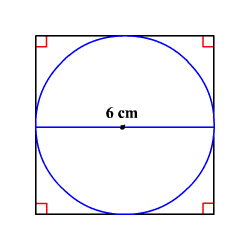

# Trumpas įvadas į programavimą

Paprašyti visų parsisiųsti kol kalbėsiu:
1. Chrome naršyklę https://www.google.com/chrome/ .
2. Git for windows https://git-scm.com/download/win .
3. Atom https://atom.io .


## Kas išvis tas programavimas?
Programavimas tai instrukcijų nustatymas kompiuteriui. Kadangi kompiuteriai,
priešingai nei žmonės nėra protingi ir negali patys sugalvoti, kaip jiems
išspręsti užduotis, jiems reikia tiksliai tą nurodyti. Gerai tik tai, kad jie
sugeba atkartoti instrukcijas duotas jiems tobulai. Tobulai reiškia, kad jas
atlieka reikiamu eiliškumu ir be matematinių ar kitokių klaidų.  
Kaip pavyzdį duosiu omleto pagaminimą. Instrukcijos kurias duoda mama tau
kai reikia pagaminti omletą:
1. Pakepink daržoves keptuvėj.
2. Išplak kiaušinius.
3. Supilk išplaktus kiaušinius į keptuvę ant daržovių.
4. SUPLAUK INDUS, NES PRAEITĄ KART BETVARKĘ PALIKAI, TINGINY.

Kadangi mes, žmonės, suprantam, kaip interpretuoti šias instrukcijas, ir
elgiamės adekvačiai priklausomai nuo konteksto lengvai pasidarysim valgyt pagal
tokias instrukcijas. Na žinant mano gaminimo sugebėjimus tikriausiai teks pirkt
naują keptuvę, bet pavalgęs būčiau.  
Tuo tarpu kompiuteriui neišeitų padaryti nei pirmos užduoties, nei antros, nei
trečios, nei ketvirtos. Kad jis sugebėtų padaryti kiaušinienę jį turėtų
ištreniruoti daryti viską smulkiausiomis detalėmis. Na, šiuo atveju tai jau būtų
robotas, o ne kompiuteris, nes kompiuteris neatlieka mechaninių veiksmų.
Pavyzdys kaip tos pačios instrukcijas reiktų nustatyti kompiuteriui:
1. Pakepink daržoves keptuvėj:
    1. Atsidaryk spintelę ir paimk:
        1. Papriką.
        2. Pomidorą.
        3. ...
    2. Atsidaryk stalčių ir paimk:
        1. Peilį.
        2. Pjaustymo lentelę
        3. ...
    3. ...
2. ...

Visko nerašiau, nes bučiau visą sekmadienį užtrukęs. Ir tai vistiek nebūtų
tikslu, nes vien "atsidaryti spintelę" turėtų būti aprašyta smulkiais veiksmais
kaip rankos kėlimu, traukimu ir panašiai. Užsiknisimas.  
Gelbsti tai, kad jei kiti programuotojai jau yra suprogramavę kaip padaryti
"atsidaryk spintelę ir paimk" veiksmą, galima panaudoti jų instrukcijas vietoj
rašymo to paties per tą patį.  Prisiminkit šitą, kai mokysimės apie funkcijas.

## Bet kaip metalo gabalas atlieka matematinius veiksmus?

Parodysiu ant lentos.


## JavaScript pagrindai

### Apie JavaScript
JavaScript yra programavimo kalba, kuria naudojantis sukurta didžioji dalis
internetinių puslapių. Taip pat galima sakyti kad ji yra populiariausia
programavimo kalba pasaulyje. Ją naudoja tokios kompanijos kaip:
1. Apple
2. Microsoft
3. Amazon
4. Google
5. Facebook
6. Bloomberg (čia dirbu aš)
7. Airbnb

Ir tikriausiai bet kuri interetinė bendrovė kurią žinote.
Tuo tarpu brangiausios pasaulio kompanijos yra:

1. Apple
2. Microsoft
3. Amazon
4. Alphabet (Google)

Ką tas reiškia? Tai reiškia, kad pinigų mokant JavaScript tikrai uždirbti
galima.

Tęsiant kalbą apie patį JavaScript, jums gali kilti klausimas, ką jis daro
pačiam internetiniam puslapyje. Bet, kadangi patys tuoj jį sukursite, greit
suprasite.

### Hello World!
Pati pirma pamoka kaip naudoti programavimo kalbą yra vadinama "Hello World!",
nes taip prieš keturiasdešimt metų pirmą C programavimo kalbos pamoką pavadino
jos kūrėjai.  
Važiuojam.  
Atsidarykite "Chrome". Ir spauskite: <kbd>Ctrl</kbd>+<kbd>Shift</kbd>+<kbd>J</kbd> (Windows),
<kbd>Cmd</kbd>+<kbd>Alt</kbd>+<kbd>J</kbd> (OsX). Atsidarys console ir tiesiog
parašykite:
```javascript
console.log("Hello World!");
```
Spauskite <kbd>Enter</kbd> ir BAAAAM!!! Kątik parašėt savo pirmąją JavaScript programą. Atrodo kietai? Žinau, kad ne. Bet tęsiam.

### Kintamieji
Kadangi jau esate gimnazijos amžiaus, tikriausiai žinote kas yra kintamasis ir
dažniausiai jį regite pažymėtą kaip ***X***. JavaScript analogija būtų:
```javascript
let x;
```
"let" iš anglų kalbos išvertus reiškia "tebūnie". Tai tiesiog kompiuteriui
pasako, kad *x* šiuo atveju yra kintamasis.  
Kaip žinote iš matematikos, kintamiesiems galima priskirti vertes ir tai labai
paprasta JavaScript'e (ir kitose programavimo kalbose).
```javascript
x = 100;
```
Galima šitą užrašyti ir viena eilute:
```javascript
let x = 100;
```

Grįžkime prie pirmojo pavyzdžio ir pabandome:
```javascript
console.log(100); // <--- naudojama 100
let x = 100;
console.log(x);   // <--- naudojama x, kurio verte 100
```
Kaip matote console'je *100* buvo parašyta du kartus. Taip yra dėl to kad
pirmoje eilutėje tiesiog sakoma "atspausdink 100", o trečioje sakoma atspausdink
*x*. Kadangi x nėra kabutėse, tai JavaScript'e reiškia, jog kalbama apie
kintamąjį ir kompiuteris bandys įstatyti jo vertę.
Dabar darome refresh <kbd>Ctrl</kbd>+<kbd>R</kbd> pabandykime:
```javascript
let x;
console.log(x);   // <--- undefined, reiskia kad verte niekada nebuvo priskirta
```
<kbd>Ctrl</kbd>+<kbd>R</kbd> Ir:
```javascript
console.log(x);   // <--- ReferenceError, KAS TAS X???
                  // Turetu but kintamasis bet niekur nepasakyta.
```

### Aritmetika
Kompiuteris yra skaičiuotuvas, tik kietesnis. Žmonės jo labai ta paskirtimi
nenaudoja, o galėtų. Pradedam aritmetiką.  
<kbd>Ctrl</kbd>+<kbd>R</kbd>
```javascript
let x = 5;
let y = 3;
let k = x + y; // <-- suma
console.log(k);
k = x - y      // <-- skirtumas
console.log(k);
k = x * y      // <-- sandauga
console.log(k);
k = x / y      // <-- dalyba
console.log(k);
k = x % y      // <-- liekana
console.log(k);
```
Padarome užduotį:  
1. *Į kintamąjį **s_kvadrato** priskirkime kvadrato kurio sienos ilgis 6 plotą.*  
2. *Į kintamąjį **s_skritulio** priskirkime skritulio, kurio skersmuo 6 plotą.*  
3. *Į kintamąjį **s_atlieka** priskirkime plotą kuris atlieka įbrėžus skritulį
iš **2** į kvadratą iš **1**.*

Iliustracija: 

### Funkcijos
